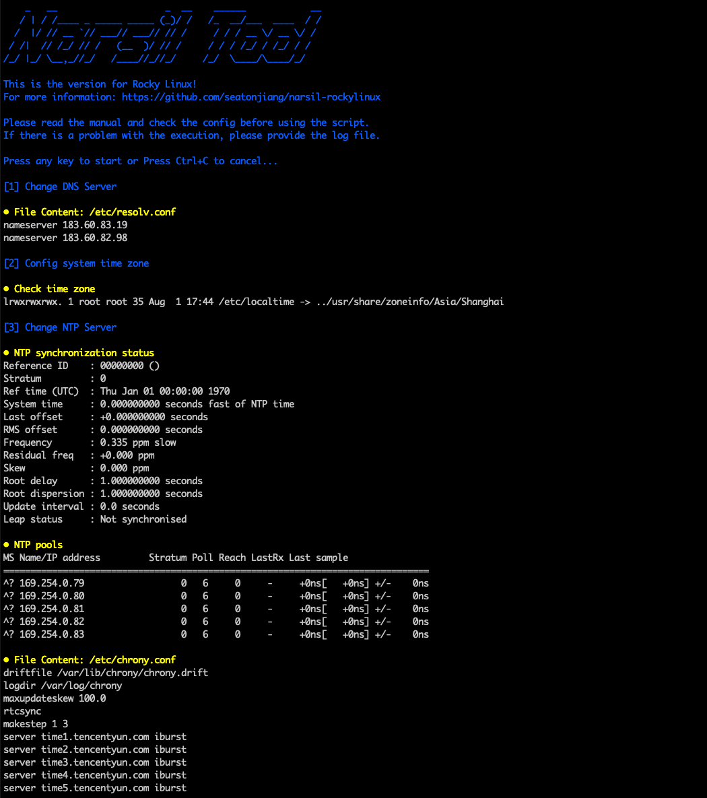
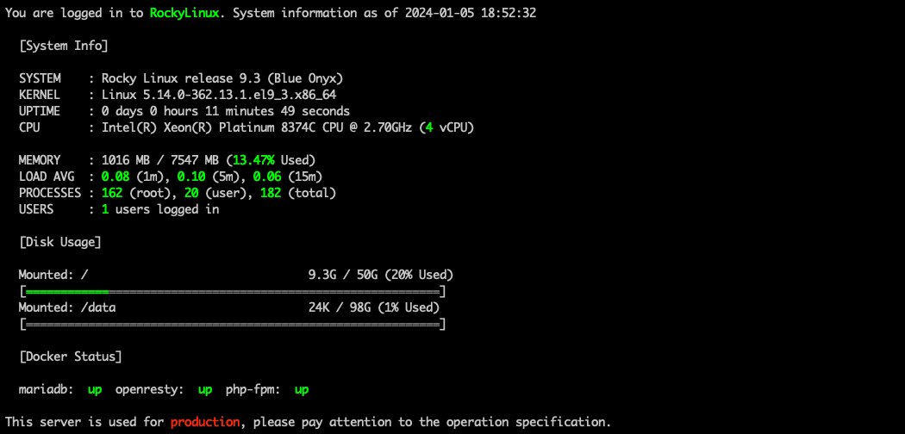
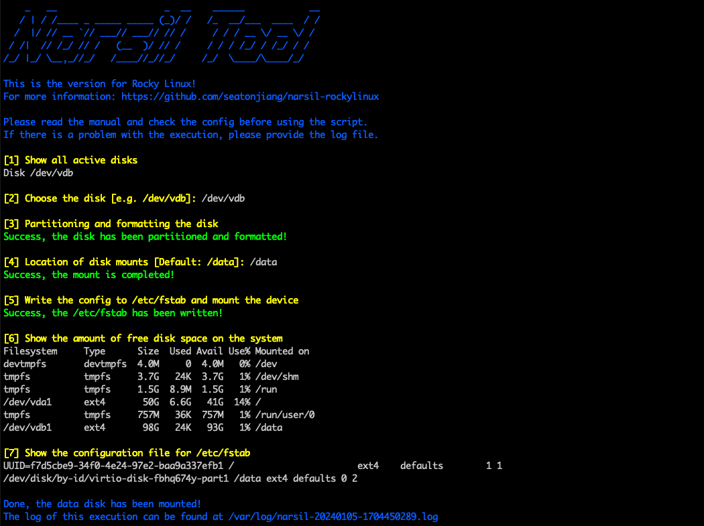

**English** | [简体中文](README.zh-CN.md)

## 💻 Screenshot

### Script Execution



### Login Information



### Mount disk



## ✨ Features

-   Restricted passwords for 30 days
-   After 30 days of password expiration, the account will be disabled.
-   Set the time between password changes to 1 day
-   Warnings will be issued 7 days before the password expires
-   Set the system default encryption algorithm to SHA512.
-   Set the session timeout policy to 180 seconds
-   Create and join a group with the same name for the new user.
-   Set the permissions on the home directory of the new user to 0750.
-   Set permissions on the home directory of existing users to 0750.
-   Enhance OpenSSH configuration (some configurations need to be configured manually)
-   Prohibit users without home directories from logging in
-   Disable SHELL login for new users
-   Disable uploading and user information.
-   Prohibit simultaneous deletion of a user's group when deleting a user.

There are many more settings that are not listed, and you can refer to the files in the `scripts` directory for more information.

## 🚀 Quick start

### Step 1: Clone the repo

Make sure you have Git installed on your server, otherwise you'll need to install the `git` software first.

```bash
git clone https://github.com/seatonjiang/narsil-rockylinux.git
```

### Step 2: Edit the config file

Go to project directory.

```bash
cd narsil-rockylinux/
```

Be sure to authenticate the contents of the config file.

```bash
vi narsil.conf
```

### Step 3: Running script

If you are root, you can run it directly, if you are a normal user please use `sudo` and you must run the script with `bash`.

```bash
sudo bash narsil.sh
```

## 📝 Config options

```ini
# Verify Operation
VERIFY='Y'

# Cloud Server Metadata Overlay (DNS Server/NTP Server/Hostname)
METADATA='Y'

# Production Environment Reminder
PROD_TIPS='Y'

# SSH Port Config
SSH_PORT='22'

# Time Zone Config
TIME_ZONE='Asia/Shanghai'

# Hostname Config
HOSTNAME='RockyLinux'

# DNS Server Config
DNS_SERVER='119.29.29.29 223.5.5.5'

# NTP Server Config
NTP_SERVER='ntp1.tencent.com ntp2.tencent.com ntp3.tencent.com ntp4.tencent.com ntp5.tencent.com'

# Docker Config
DOCKER_CE_REPO='https://mirrors.cloud.tencent.com/docker-ce/linux/centos/docker-ce.repo'
DOCKER_CE_MIRROR='mirrors.cloud.tencent.com'
DOCKER_HUB_MIRRORS='https://hub-mirror.c.163.com'
```

## 📂 Structure

A quick look at the folder structure of this project.

```bash
narsil-rockylinux
├── narsil.conf
├── narsil.sh
├── config
│   └── (some config files)
└── scripts
    └── (some script files)
```

## 🔨 Modular

Narsil contains a number of standalone functions that are not in the auto-executed script and need to be used separately using parameters, which can be viewed using the `sudo bash narsil.sh -h` for all standalone functions.

### Clear system

Clear all system logs, cache and backup files.

```bash
sudo bash narsil.sh -c
```

### Install docker

Install docker service and set registry mirrors, and add run permission for non-root accounts.

> After installation, please use `docker run hello-world` to test docker.

```bash
sudo bash narsil.sh -d
```

### Mount disk

Interactively mount the data disk, the data is priceless, remember to be careful during the operation!

> If the selected hard disk is already mounted, you will be prompted to unmount and format the operation.

```bash
sudo bash narsil.sh -f
```

### Modify hostname

The default is `RockyLinux`, if `METADATA=Y` then the default name is the name of the metadata fetch.

> The metadata feature is currently only supported on Tencent Cloud servers.

```bash
sudo bash narsil.sh -n
```

### Modify the SSH port

Interactively modify the SSH port.

> The port range is recommended to be between 10000 and 65535.

```bash
sudo bash narsil.sh -p
```

### Uninstall agent

Uninstalls various monitoring components installed into the server by the service provider.

> This feature is currently only supported on Tencent Cloud servers.

```bash
sudo bash narsil.sh -r
```

### Add swap space

If memory is too small, it is recommended to add swap space.

```bash
sudo bash narsil.sh -s
```

## 🤝 Contributing

We welcome all contributions. You can submit any ideas as Pull requests or as Issues, have a good time!

## 📃 License

The project is released under the MIT License, see the [LICENCE](https://github.com/seatonjiang/narsil-rockylinux/blob/main/LICENSE) file for details.
